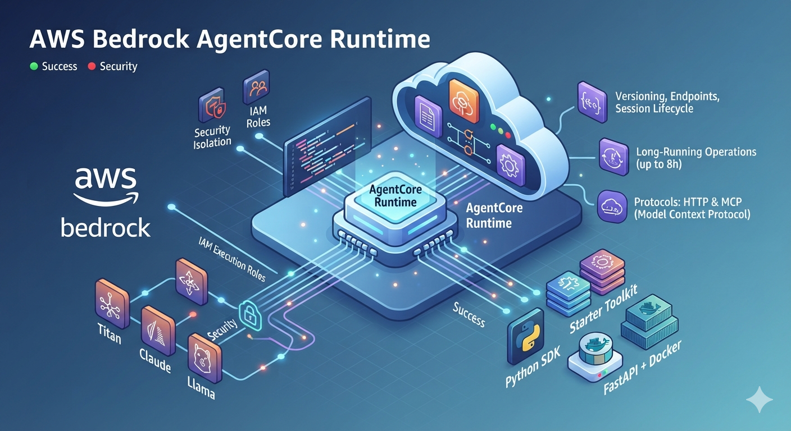

<p align="center">
  
</p>

# AWS Bedrock AI Agents: Enterprise Orchestration with AgentCore Runtime

This repository is a comprehensive guide and production-ready workspace dedicated to building, deploying, and scaling autonomous AI agents on AWS using **Amazon Bedrock** and the **AgentCore Runtime** framework.

---

## 📋 Overview

This project provides a practical approach to modern AI agent architectures, covering everything from conceptual design to cloud deployment:

- **✅ AgentCore Architecture:** Deep dive into modules and their specialized functionalities.
- **✅ Production Use Cases:** Practical implementations for building and orchestrating robust AI agents.
- **✅ Bedrock Integration:** Evaluation of the core benefits of running AgentCore on Amazon Bedrock for scalable AI workflows.
- **✅ Financial Engineering:** Cost considerations, pricing overview, and budget optimization strategies.
- **✅ Enterprise Insights:** Practical, actionable knowledge tailored for Developers, ML Engineers, and Cloud Architects.

---

## 🚀 Core Features

The technical implementations showcased in this repository leverage advanced capabilities of the **AgentCore Runtime**:

- **Scalable Hosting:** Deep dive into how AgentCore Runtime hosts, executes, and dynamically scales AI agents.
- **State & Lifecycle Management:** Built-in versioning, production endpoints, and session lifecycle isolation.
- **Enterprise-Grade Security:** Strict security isolation coupled with AWS IAM execution roles for fine-grained access control.
- **Long-Running Operations:** Architecture patterns optimized to handle continuous processing tasks lasting up to 8 hours.
- **Modern Development Stack:** Built using the official Starter Toolkit and Python SDK backed by FastAPI and Docker containment.
- **Multi-Protocol Support:** Production endpoints optimized for traditional HTTP REST APIs and the modern **Model Context Protocol (MCP)**.

---

## 🛠️ Roadmap: What I Will Do

This repository follows a structured, step-by-step engineering roadmap:

- 🔹 **Design & Configuration:** Create and configure a production-ready Agent using the AgentCore Runtime ecosystem.
- 🔹 **Cloud Security Setup:** Provision IAM execution roles and establish secure cloud environment prerequisites.
- 🔹 **AWS Deployment:** Deploy the AgentCore application on an AWS EC2 instance using containerized workflows.
- 🔹 **E2E Validation:** Invoke the deployed agent through secure API endpoints and structurally validate model responses.
- 🔹 **Observability:** Implement real-time debugging, logging, and performance monitoring pipelines for agent health tracking.

---

## 📂 Repository Structure

```text
├── 📂 .github/workflows/          # CI/CD deployment pipelines
├── 📂 src/                        # Main Python application source code (FastAPI)
│   ├── 📂 agents/                 # Agent core logic and configuration
│   └── 📂 tools/                  # Custom tool definitions and MCP integrations
├── 📂 terraform/                  # Infrastructure as Code (IaC) for AWS EC2 & IAM
├── Dockerfile                     # Containerization blueprint
├── requirements.txt               # Python dependencies
└── README.md                      # Project documentation
```

---
*Developed with a production-first mindset for modern AI infrastructure.*
