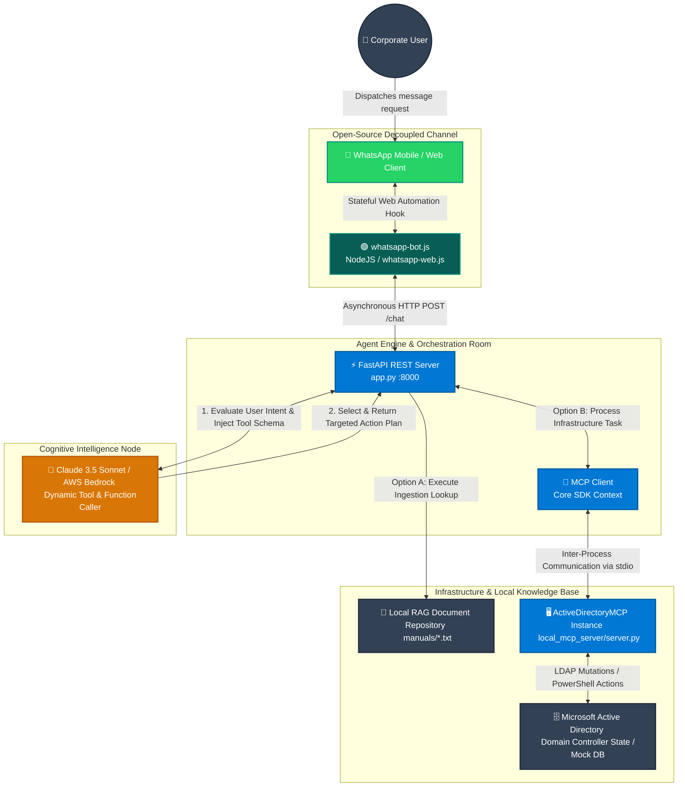

# Corporate IT & HR Support Agent (Active Directory & Local RAG)

<p align="center">
  
</p>

An enterprise-grade, asynchronous AI Agent architecture designed to automate corporate IT operations and HR inquiry management. This project decouples cognitive reasoning from active execution by utilizing Anthropic's **Model Context Protocol (MCP)** to securely interface with **Microsoft Active Directory** infrastructure. It concurrently deploys a **Retrieval-Augmented Generation (RAG)** pipeline to surface localized compliance and operational data over an open-source, decoupled messaging channel (**WhatsApp**).

---

## 📊 System Architecture

The blueprint below highlights how the application separates messaging interfaces, cognitive orchestration, and secure backend transport layers.



### 🔧 Architectural Design Patterns

1. **Strict Separation of Concerns (SoC):** The messaging wrapper (`NodeJS`) runs entirely independently from the agent intelligence center (`FastAPI`). This stateless separation ensures that switching to corporate channels like **Microsoft Teams** or **Slack** requires zero modifications to the core agent logic.
2. **Model Context Protocol (MCP) Integration:** Instead of building fragile, highly coupled scripts directly bound to the LLM wrapper, the application utilizes the **MCP Open Standard**. The orchestrator communicates with isolated external infrastructure engines across secure standard input/output (`stdio`) pipelines.
3. **Cloud & Serverless Ready:** The code is explicitly engineered for enterprise orchestration layers such as **AgentCore** and **AWS Lambda**. Its stateless, asynchronous API endpoints map directly into AWS VPC infrastructure without altering core code layers.

---

## 🧠 Applied Engineering Skills

This deployment demonstrates core capabilities required to engineer robust, enterprise-compliant AI workflows:

*   **Agentic Architecture & Tool Use (Function Calling):** Leverages Claude 3.5 Sonnet to autonomously evaluate real-time user intents, selecting between static documentation lookup or active network infrastructure mutations without hardcoded routing tables.
*   **Model Context Protocol (MCP) Production Setup:** Establishes secure runtime environments executing decoupled infrastructure actions via an abstraction layer, minimizing surface-level network vulnerabilities.
*   **Hybrid Data Provisioning (RAG):** Manages a responsive local text-ingestion engine parsing multi-layered parameters (e.g., printer settings, employee handbooks) and dynamically abstracts context data to eliminate LLM prompt bloat.
*   **Enterprise Infrastructure Safeguards:** Built an Active Directory orchestration model that includes mock state sandboxing for high-fidelity testing prior to execution against actual cloud-hosted domain controllers.

---

## 📁 Repository Structure

```text
CORPORATE-IT-AGENT/
├── agent_config.json          # AgentCore Deployment & Provisioning Manifesto
├── package.json               # Node.js Dependencies (WhatsApp Interface)
├── package-lock.json
├── node_modules/
├── backend/
│   ├── app.py                 # Core AI Orchestrator API (FastAPI)
│   ├── requirements.txt       # Python Libraries
│   └── manuals/               # Local RAG Knowledge Base Storage
│       ├── printer_setup_guide.txt
│       └── vacation_policy.txt
└── local_mcp_server/
    ├── agente_suport.py       
    └── server.py              # Custom AD MCP Server (With Test Mock DB Engine)
```

---

## 🚀 Getting Started & Execution

Follow these step-by-step instructions to boot the system locally on your environment.

### Prerequisites
*   Python 3.10+
*   Node.js v18+
*   An active Anthropic API Key (or AWS Bedrock access keys)

### 1. Configure the MCP Protocol Mapping
Open `backend/app.py` and ensure the `SERVER_PARAMS` arguments reflect the path where `server.py` sits on your workspace:
```python
SERVER_PARAMS = StdioServerParameters(
    command="python",
    args=["../local_mcp_server/server.py"], # Verify this matches your file layout relative path
    env={ ... }
)
```

### 2. Set Up Environment Variables
Export your operational keys to your active shell session:

*   **Windows (PowerShell):**
    ```powershell
    \$env:ANTHROPIC_API_KEY="your_actual_api_key_here"
    ```
*   **Linux / macOS (Bash):**
    ```bash
    export ANTHROPIC_API_KEY="your_actual_api_key_here"
    ```

### 3. Spin Up the Agent Core Engine (Terminal 1)
Navigate into the backend scope, provision dependencies, and launch your REST framework:
```bash
cd backend
pip install -r requirements.txt
uvicorn app:app --host 127.0.0.1 --port 8000 --reload
```
*Leave this session open. The terminal logs will display the live agent cognitive traces and tool invocations.*

### 4. Boot the WhatsApp Messaging Layer (Terminal 2)
Open an entirely separate terminal session at the root folder to spin up your automation hook:
```bash
npm install
node backend/whatsapp-bot/whatsapp-bot.js
```

### 5. Link Account & Validate Sandbox
1. Upon running `npm start`, a terminal-based **QR Code** will generate on screen.
2. Open WhatsApp on your target testing mobile phone, head into **Linked Devices**, and scan the code.
3. Once authenticated, text the bot from an external phone number to fire off workflow evaluations:
    *   **Verify RAG Extraction:** `"How do I configure the office printers on Windows?"`
    *   **Verify Infrastructure Mutation (Active Directory):** `"Please unlock the account for user john.doe"`

---

## 🌐 Enterprise Production Cloud Migration (AgentCore)

To transfer this application out of local sandboxes and host it inside production topologies:
1. Push this complete project structure onto your corporate Version Control System (Git).
2. The orchestration portal (**AgentCore**) automatically parses `agent_config.json` to assign operational policies, memory gateways, and active hooks.
3. Transition variables mapped under `SERVER_PARAMS` to secure **AWS Secrets Manager** references, and wrap `local_mcp_server/server.py` scripts inside secure, elastic **AWS Lambda Functions** running privately in your corporate VPC.
